# Projektdokumentation - [Projekttitel]

## Inhaltsverzeichnis

1. [Ausgangslage](#1-ausgangslage)
2. [Lösungsidee](#2-lösungsidee)
3. [Vorgehen & Artefakte](#3-vorgehen--artefakte)
   1. [Understand & Define](#31-understand--define)
   2. [Sketch](#32-sketch)
   3. [Decide](#33-decide)
   4. [Prototype](#34-prototype)
   5. [Validate](#35-validate)
4. [Erweiterungen [Optional]](#4-erweiterungen-optional)
5. [Projektorganisation [Optional]](#5-projektorganisation-optional)
6. [KI-Deklaration](#6-ki-deklaration)
7. [Anhang [Optional]](#7-anhang-optional)

> **Hinweis:** Massgeblich sind die im **Unterricht** und auf **Moodle** kommunizierten Anforderungen.

<!-- WICHTIG: DIE KAPITELSTRUKTUR DARF NICHT VERÄNDERT WERDEN! -->

<!-- Diese Vorlage ist für eine README.md im Repository gedacht. Abschnitte mit [Optional] können weggelassen werden, wenn in den Übungen nichts anderes verlangt wird. -->

## 1. Ausgangslage

- **Problem:** Basketballspieler, die allein trainieren, haben Schwierigkeiten, strukturierte und intensive Workouts zu planen. Ohne Coach, Team oder klare Trainingsvorlagen fühlt sich das Training unproduktiv an. Es fehlen Erfolgsmasssstäbe, Fortschrittstracking und Motivation für regelmässiges Solo-Training.

- **Ziele:**
  - Training sinnvoller und zielgerichteter gestalten

  - Trainingsmotivation und Regelmässigkeit steigern

  - Fortschrittstracking ermöglichen -

  - Spass am Basketball fördern, auch beim Solo-Training

- **Primäre Zielgruppe:** Basketballspieler (unterschiedliche Erfahrungsstufen), die allein ohne Team oder Trainer trainieren und strukturierte, intensive Workouts mit Fortschrittsdokumentation benötigen.

## 2. Lösungsidee

- **Kernfunktionalität:**
  - **Exercise-Bibliothek**: Nutzer können Exercises anzeigen, erstellen, bearbeiten und löschen
  - **Workout-Planung**: Exercises zu Workouts kombinieren mit Auswahlformular und automatischer Duration-Berechnung
  - **Session-Durchführung**: Workouts starten, Fortschritt tracken mit To-do-Modus und Fortschrittsbalken
  - **Filterung**: Nach Kategorie (z.B. Shooting, Dribbling), Level (Beginner bis Advanced) und Zeit filtern
  - **Pausentimer**: Konfigurierbare Pausen zwischen Exercises
  - **Workout-History**: Speicherung der durchgeführten Trainings-Sessions mit Zeitstempel und Dauer
  - **Favoriten-System**: Workouts als Favoriten markieren für schnellen Zugriff
  - **Auto-Duration**: Automatische Berechnung der Workout-Dauer basierend auf ausgewählten Exercises
  - **Toast-Notifications**: Visuelles Feedback bei CRUD-Operationen

  **Annahmen:**
  - Basketballspieler suchen nach einer kostenlosen Lösung für Solo-Training -> Hypothese durch mein eigenes Interesse geprüft, ebenfalls durch Marktrecherche ein Interesse erkannt
  - Visuelle Card-Darstellung erleichtert die Übersicht und Auswahl -> geprüft durch Skizzierungen von Übung 9
  - Verschiedene Erfahrungsstufen benötigen unterschiedliche Komplexitätsstufen (von vorgefertigten Templates bis zu individueller Workout-Erstellung) -> die Hypothese ist bei Sport anwendbar, auch durch eigene Erfahrung bestätigt

- **Abgrenzung:**
  - Keine Videoanalyse oder Filmaufnahmen
  - Keine Team-/Coach-Funktionen
  - Keine kostenpflichtigen Features
  - Fokus auf Solo-Basketball-Training

## 3. Vorgehen & Artefakte

### 3.1 Understand & Define

**Zielgruppenverständnis:**
**Problemräume (aus Übung 1):**

1. Schwierigkeit, Bildschirmzeit zu reduzieren
2. Solo-Basketball-Training fühlt sich nicht intensiv und geplant genug an
3. Zeit fühlt sich knapp an durch Schul-, Arbeit- und Freizeitbedürfnisse, obwohl viel Zeit mit aktivem Nichtstun verbracht wird

**Nutzer & Bedürfnisse (aus Übung 2):**

- **Nutzer**: Basketballspieler, die allein (ohne Team/Trainer) trainieren
- **Bedürfnisse**: Strukturiertes, intensives Training mit klarem Plan und Fortschrittsgefühl
- **Kontext**: Allein auf dem Platz, kein Coach, kein Gegner, begrenzte Zeit, keine Trainingsvorlagen, keine Erfolgsmasssstäbe
- **Herausforderungen**: Kein Feedback, mangelnde Motivation, kein Überblick über Schwächen, Training fühlt sich unproduktiv an, keine Daten über bisherige Trainingsverläufe und keine Vergleichsmöglichkeiten

**How Might We (Übung 3):**

- Wie könnten wir Einzeltrainings so gestalten, dass sie die Trainingsmotivation, Regelmässigkeit und Intensität steigern?
- Wie könnten wir Basketballspielern helfen, gezielt an ihren Schwächen zu arbeiten?
- Wie könnten wir das durchgeführte Training nutzen und verarbeiten, um gezielte Verbesserungsvorschläge und Vergleiche zu generieren?

**Personas:**

_Persona 1 - Marc (Der Erfahrene)_

- 24 Jahre, spielt seit 8 Jahren Basketball, trainiert 4x pro Woche allein
- Ziele: Individuelle Workouts erstellen, gezielt an Schwächen arbeiten, Fortschritt tracken
- Frustrationen: Bestehende Apps zu simpel, will volle Kontrolle über Trainingsinhalte
- Zitat: "Ich weiss schon, was ich will. Ich brauche Flexibilität, keine vorgefertigten Templates."

_Persona 2 - Julia (Die Strukturierte)_

- 20 Jahre, spielt Basketball im Verein, trainiert 2x pro Woche solo zur Ergänzung
- Ziele: Strukturiertes Training mit Templates, schnell starten können, Abwechslung
- Frustrationen: Alles manuell eintippen dauert zu lange, braucht gute Basis zum Anpassen
- Zitat: "Gib mir eine gute Vorlage, dann passe ich sie an. Ich will nicht von null anfangen."

_Persona 3 - Tim (Der Einsteiger)_

- 17 Jahre, spielt seit 1 Jahr Basketball, unsicher bei Trainingsplanung
- Ziele: Geführtes Training, klare Anweisungen, Motivation durch Fortschritte
- Frustrationen: Zu viele Optionen überfordern, weiss nicht welche Übungen zusammenpassen
- Zitat: "Ich brauche Hilfe beim Planen. Sag mir, was ich trainieren soll."

**Wesentliche Erkenntnisse aus Recherche:**

- **Funktionen heute:** Viele YouTube-Videos, Blogbeiträge und Reddit-Posts zu Basketball-Übungen existieren, aber nur in Textform ohne Benutzeroberfläche. Übungen fokussieren meist auf einen Bereich (Werfen, Dribbeln, Kraft), kein ganzheitliches Workout-Planning möglich ohne grossen Zeitaufwand.
- **Existierende Lösungsansätze:** Keine kostenlosen Apps für Basketball-Solo-Workouts. Tracking-Apps wie Hudl, HomeCourt oder Dr. Dish sind teuer und auf Teams/Organisationen ausgerichtet. Grosser Markt für Solo-Fitness-Workouts existiert (Orientierung für Übungsdarstellung, Feedback, Vergleiche).
- **Verbesserungsansatz:** Kombination aus bestehendem Wissen der Basketball-Community und bewährten Workout-Planer-Konzepten.

### 3.2 Sketch

**Variantenüberblick:**

In Übung 9 wurden 8 verschiedene Varianten für die Workout-Erstellung skizziert und mit drei Testpersonen (P1, P2, P3) evaluiert:

1. **Formularvariante**: Manuelles Ausfüllen aller Felder
2. **Templatevariante**: Vorgefertigte Workout-Templates nach Kategorien
3. **Drag & Drop**: Interaktives Zusammenstellen durch Ziehen von Übungen
4. **Auswahlvariante**: Geführte Abfrage (Zeit, Ziel, Level)
5. **Listenvariante**: To-do-Listen-Format
6. **KI-Generator**: Automatische Workout-Generierung
7. **Cardsvariante**: Visuelle Cards mit Bildern/Icons
8. **Zeitbasiert**: Fokus auf zeitbasierte Intervalle (HIIT-Style)

**Skizzen:**
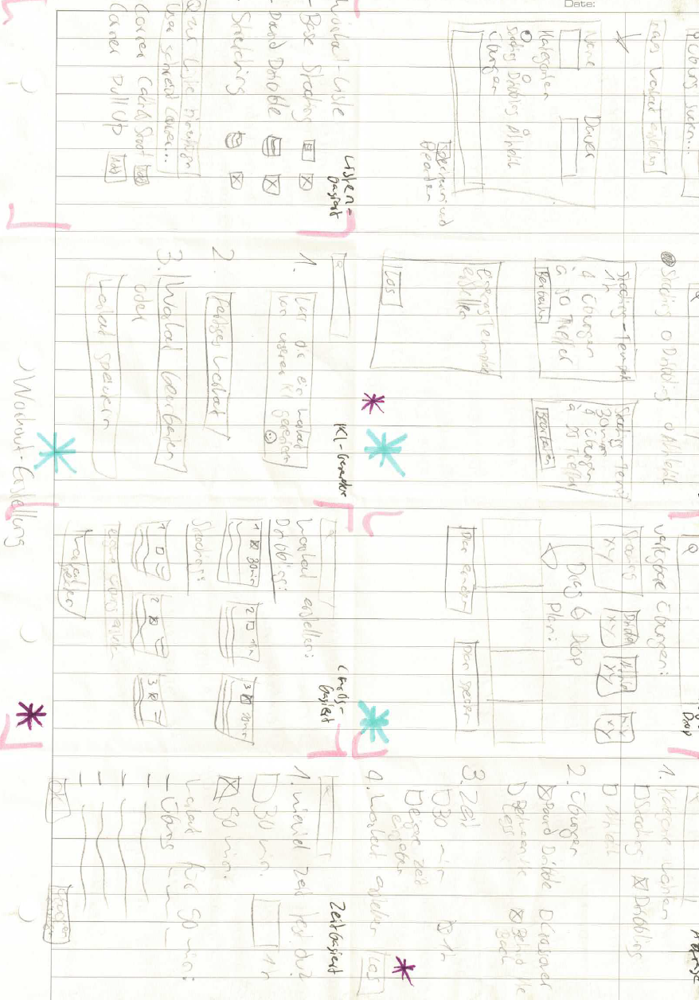
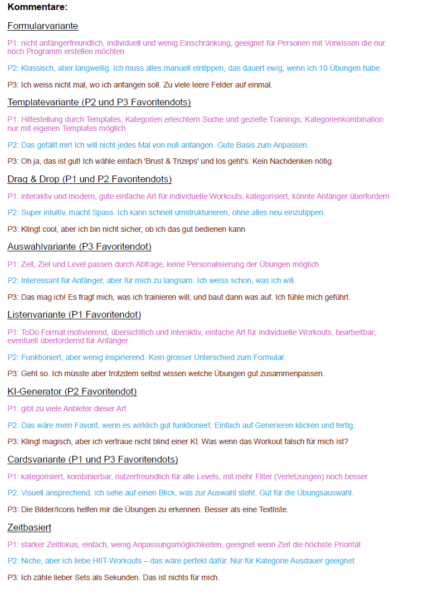
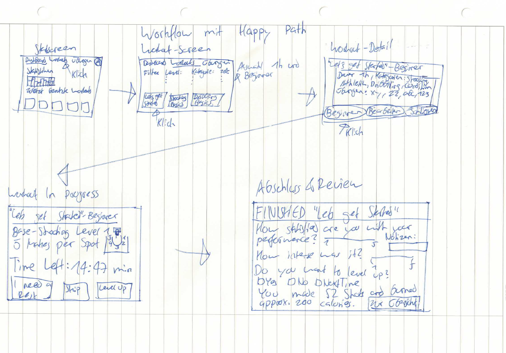

**Feedback der Testpersonen:**

- **P1 (Erfahren)**: Bevorzugt Drag & Drop, Cards und Liste. Ablehnung von Templates und KI-Generator (zu wenig Kontrolle). -
- **P2 (Strukturiert)**: Favorisiert Templates, KI-Generator und Drag & Drop. Formular zu langsam.
- **P3 (Einsteiger)**: Präferiert Auswahl-Variante, Cards und Templates. Drag & Drop unsicher, ob bedienbar.

**Unterschiede:**

- **Komplexität**: Von vollautomatisch (KI) bis vollständig manuell (Formular)
- **Flexibilität**: Templates bieten Basis, Drag & Drop volle Freiheit
- **Visualisierung**: Cards visuell, Formular textbasiert
- **Zielgruppe**: Templates/Auswahl für Einsteiger, Drag & Drop/Liste für Erfahrene

### 3.3 Decide

**Gewählte Variante & Begründung:**

Die **Cards-Variante** wurde als Basis gewählt und mit Elementen aus anderen Skizzen erweitert.

**Hauptgründe:**

- Visuelle Klarheit: Cards zeigen Übungen/Workouts auf einen Blick ohne lange Texte
- Skalierbarkeit: Funktioniert für Anfänger (vorgefertigte Cards) und Fortgeschrittene (eigene Erstellung)
- Filterbarkeit: Cards lassen sich einfach nach Kategorie, Level und Zeit filtern
- Positive Resonanz: Alle drei Personas bewerteten Cards positiv

**Integrierte Elemente aus anderen Varianten:**

- Drag & Drop für Workout-Erstellung (Reihenfolge der Exercises)
- To-do-Modus mit Fortschrittsbalken während der Session (aus Listenvariante)
- Pausentimer zwischen Exercises
- Filter nach Kategorie, Level, Zeit
- Favoriten-System
- Workout-Rating und History nach Abschluss

**Entscheidkriterien:**

1. Intuitive Bedienbarkeit für alle Erfahrungsstufen
2. Flexibilität von simpel (vorgefertigte Workouts starten) bis komplex (eigene Exercises erstellen und kombinieren)
3. Visuelle Attraktivität
4. Motivationsfaktoren (Fortschritt, Rating, History)

**End-to-End-Ablauf:**

Der Haupt-Workflow beschreibt den Nutzerpfad aus Sicht von **Tim (Der Einsteiger)** vom ersten Öffnen der App bis zum Abschluss des ersten Workouts.

_User Journey Map:_

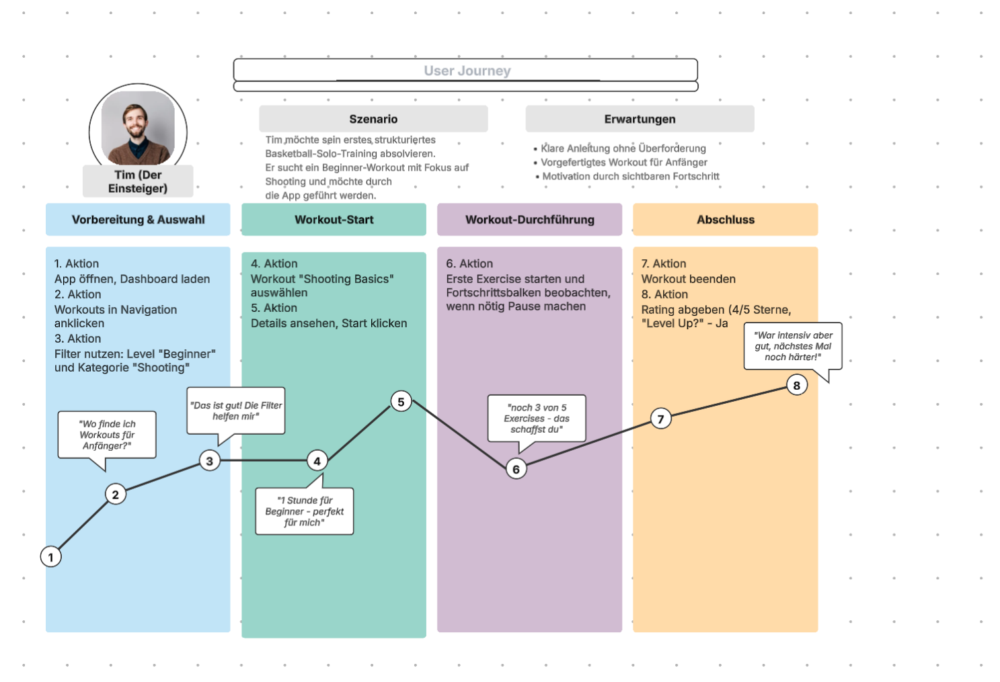

Die Journey zeigt 8 Schritte über 4 Phasen:

1. Vorbereitung & Auswahl (Punkte 1-3):

- App erkunden
- Filter nutzen

2. Workout-Start (Punkte 4-5):

Workout auswählen und starten

3. Durchführung (Punkt 6):

Exercises abarbeiten mit Fortschrittsanzeige

4. Abschluss (Punkte 7-8):

- Workout beenden
- Rating abgeben
- Level-Up planen

Die Emotionskurve zeigt: Anfängliche Unsicherheit wird durch hilfreiche Filter und klare Strukturierung zu Motivation. Während der Durchführung ist das Training anstrengend aber machbar. Am Ende entsteht ein Erfolgsgefühl und Motivation für das nächste Training.

_Workflow-Diagramm_:

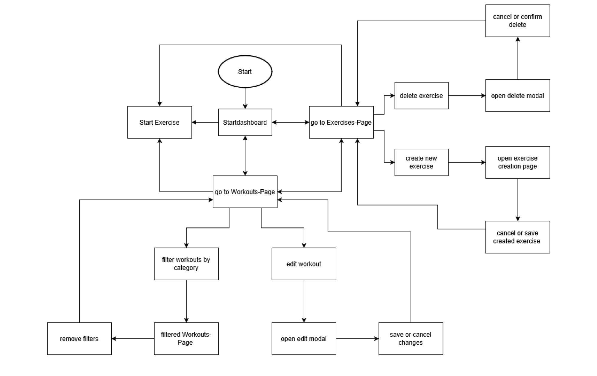

Das technische Workflow-Diagramm ergänzt die User Journey Map durch detaillierte Darstellung aller möglichen Navigationspfade und Interaktionen (Exercise-/Workout-Management, Filter, Modals).

**Mockup:**

Figma-Prototyp:

[https://www.figma.com/proto/NJ624feVSuq4Rk1C0z9H0A/BallToTheTop](https://www.figma.com/proto/NJ624feVSuq4Rk1C0z9H0A/BallToTheTop?node-id=0-1&t=V8ZxGAKPWe3lWihV-1)

**Screenshots mit Beschreibungen:**

- Dashboard:
  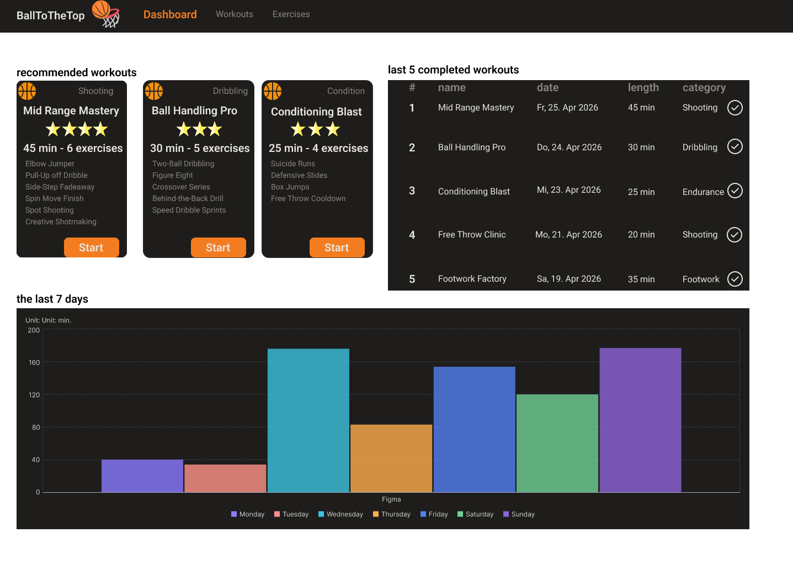
- Workout-Detail:
  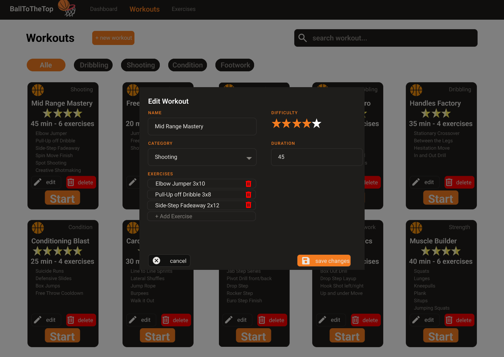
- Session-Screen:
  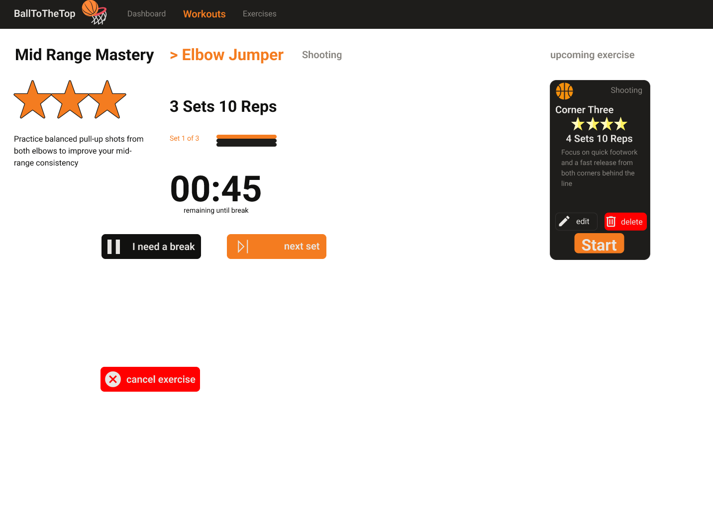

### 3.4 Prototype

#### 3.4.1. Entwurf (Design)

Beschreibt die Gestaltung und Interaktion.

> **Hinweis:** Hier wird der **Prototyp** beschrieben, nicht das **Mockup**.
> **Informationsarchitektur:**

Die App besteht aus drei Hauptbereichen mit Topbar-Navigation:

1. **Dashboard**: Startseite mit direktem Zugriff auf Workouts, schneller Einstieg möglich
2. **Workouts**: Verwaltung (Anzeigen, Erstellen, Bearbeiten, Löschen) von Workouts
3. **Exercises**: Verwaltung der einzelnen Übungen, aus denen Workouts zusammengestellt werden

Diese Trennung dient der Übersichtlichkeit - Workouts und Exercises auf einer Seite wären überfordernd.

**User Interface Design:**

- Dashboard
  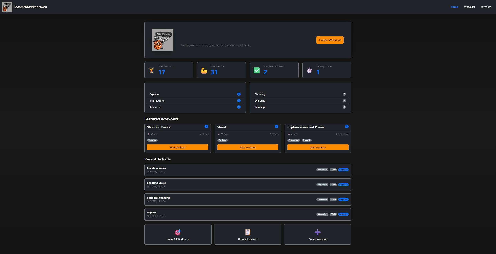
- Exercise-Formular
  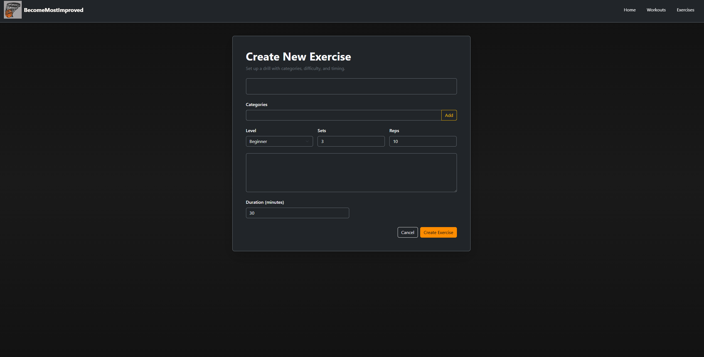
- Workout-Builder
  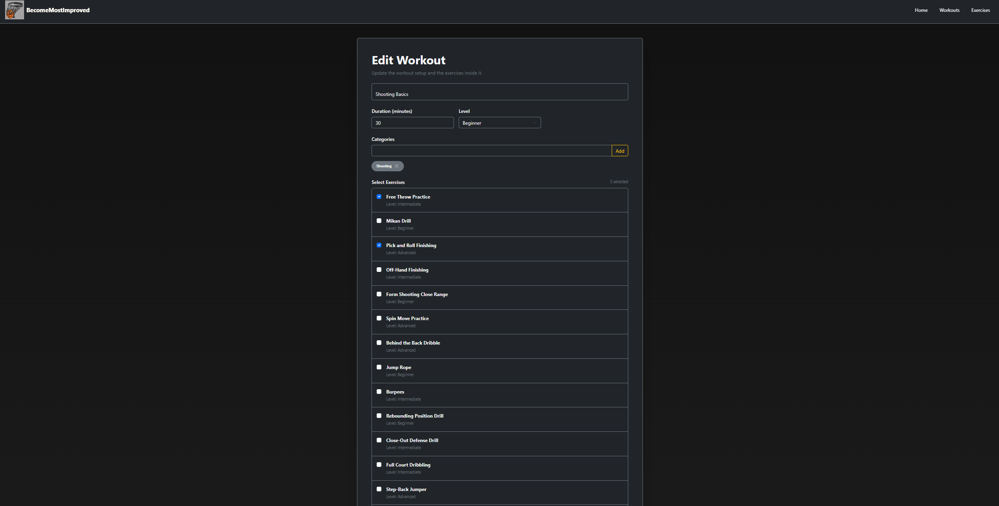
- Session-Durchführung
  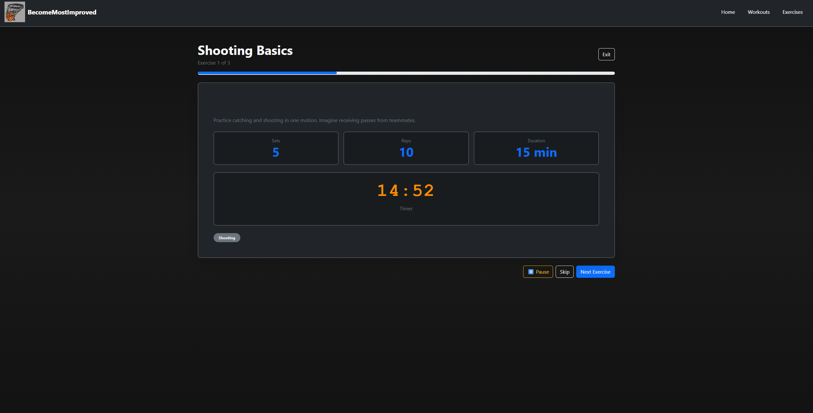

**Designentscheidungen:**

_Desktop vs. Mobile_

Entscheidung für Desktop-First, da:

- Prototyp auf Desktop erstellt und getestet
- Mobile Layouts erfordern viele Verschachtelungen, schränken Umsetzung ein
- Cards, Tabellen, Formulare grosszügig darstellbar

_Navigation_

Topbar-Navigation mit Logo links, drei Hauptbereiche (Dashboard, Workouts, Exercises) als Textlinks. Etabliertes Pattern für Desktop-Web-Apps. Aktiver Bereich durch Akzentfarbe Orange hervorgehoben.

_Dark Mode_

Dunkle Benutzeroberfläche wirkt bei Sport-Apps energetisch und modern. Persönliche Präferenz für dunkles Theme.

_Farbkonzept_

Orange als Akzentfarbe (Assoziation mit Basketball). Bewusster Verzicht auf viele Farben zur Vermeidung von Verwirrung. Alle Buttons mit gleicher Funktion sehen identisch aus (Konsistenz).

_Start-Button auf Cards_

Direkter Start-Button auf jeder Card reduziert Klicks - kein Umweg über Detailseite nötig.

_Löschen-Modal_

Bestätigungs-Modal vor dem Löschen verhindert versehentliche Datenverluste bei aufwändig erstellten Workouts.

_Edit vs. New_

Edit als Modal (schnelle Anpassung vorhandener Daten), New als eigene Page (strukturierte Führung durch Platzhalterfelder).

_Sprache_

Englisch, da Basketball-Fachbegriffe (Crossover, Fadeaway, Reps, Sets) auf Deutsch nicht gebräuchlich sind.

#### 3.4.2. Umsetzung (Technik)

**Technologie-Stack:**

- **SvelteKit**: Framework für die gesamte Webanwendung
- **Bootstrap**: UI-Framework für Layout, Cards, Buttons und Formulare (global eingebunden)
- **MongoDB**: NoSQL-Datenbank für Persistenz (über offiziellen MongoDB-Treiber)

- **Zusätzliche Dependencies**:
  - `dotenv`: Umgebungsvariablen-Management
  - `@neoconfetti/svelte`: Konfetti-Effekte (vorhanden, aktuell nicht aktiv genutzt)

**Tooling:**

- **VS Code**: Entwicklungsumgebung
- **GitHub Copilot**: KI-Unterstützung für Code-Vorschläge und Auto-Completion
- **Netlify**: Deployment-Plattform für Hosting
- **MongoDB Atlas**: Cloud-Datenbank-Hosting
- **Git/GitHub**: Versionsverwaltung und Repository-Management
- **Vite**: Build-Tool (integriert in SvelteKit)
- **ESLint**: Code-Qualitätssicherung

**Struktur & Komponenten:**

Die Projektstruktur folgt der typischen SvelteKit-Organisation.

**Wichtige Komponenten:**

- **ExerciseCard**: Visuelle Darstellung einzelner Exercises mit Actions (Start, Edit, Delete)
- **WorkoutCard**: Visuelle Darstellung von Workouts mit Actions (Start, Edit, Delete, Favorite-Toggle)
- **ToastNotification**: Globale Toast-Benachrichtigungen (Success/Error)
- Formulare und Timer sind direkt in den jeweiligen Pages implementiert

**State-Management:**

Minimal Store-Nutzung:
- **Toast-Store**: `src/lib/stores/toast.js` für globale Toast-Notifications
- **Lokal**: Reactive Variables in Komponenten und Seiten
- **Serverseitig**: Daten werden über SvelteKit `load`-Funktionen geladen
- **Einziger Store**: SvelteKit-integrierter `$page`-Store für Navigation und mobiles Menü im Layout

**Daten & Schnittstellen:**

**Datenbank (MongoDB Atlas):**

**Collections**:
  - `exercises`: Speichert alle Exercises (name, category, level, sets, reps, duration, description)
  - `workouts`: Speichert Workouts mit Referenzen zu Exercises
  - **Neue Felder**: `isFavorite` (boolean), `favoritedAt` (date), `pausePerExercise` (number)
  - **sessions**: Speichert abgeschlossene Trainings-Sessions
   - **Felder**: workoutId/exerciseId, startedAt, completedAt, `actualDurationSeconds`

Die Historie wird über die `sessions`-Collection abgebildet, nicht über eine separate History-Collection.

**API-Kommunikation:**

- **API-Routen**: REST-API unter `/api` mit drei Hauptendpunkten:
  - `/api/exercises`: CRUD-Operationen für Exercises
  - `/api/workouts`: CRUD-Operationen für Workouts
  - `/api/sessions`: CRUD-Operationen für Sessions
- **SvelteKit Form Actions**: Für formularbasierte CRUD-Operationen
- **Serverseitige `load`-Funktionen**: Datenabruf aus MongoDB in `+page.server.js`-Dateien
- **Direkte Datenbankabfragen**: MongoDB-Treiber in Server-Routen

**API-Routen:**
- `/api/exercises` - Exercise CRUD
- `/api/workouts` - Workout CRUD
- `/api/workouts/toggleFavorite` - Favoriten-Toggle
- `/api/sessions` - Session-Tracking

**Deployment:**

URL: [https://becomemostimproved.netlify.app](https://becomemostimproved.netlify.app)

**Deployment-Konfiguration:**

- **Plattform**: Netlify
- **Build-Command**: `npm run build` (erzeugt SvelteKit-Adapter-Output)
- **Publish-Directory**: `build` (laut netlify.toml)
- **Umgebungsvariablen**: MongoDB-Connection-String über Netlify Environment Variables

**Besondere Entscheidungen:**

**MongoDB statt MySQL:**

- Flexibles Schema passend für iterative Entwicklung (kein fixes Schema nötig)
- Schnelle Prototyping-Phase profitiert von document-based Structure
- Einfache Integration mit SvelteKit (JSON-Datenformat)
- Cloud-Hosting mit MongoDB Atlas kostenlos verfügbar

**Bootstrap statt Tailwind CSS:**

- Schneller Einstieg durch vorgefertigte Komponenten
- Konsistentes Design ohne Custom-Styling
- Mobile-First Responsive Design out-of-the-box
- Trotz persönlicher Präferenz für Tailwind: Bootstrap beschleunigt Prototyping

**API-Routen zusätzlich zu Form Actions:**

- Ermöglicht flexible Client-/Server-Kommunikation
- Vorbereitung für mögliche externe Anbindungen oder mobile Apps
- Klare Trennung zwischen API-Logik und Page-Logik

**Gezielter Einsatz von Custom Stores:**

- Ein globaler Toast-Store reicht aus, um Feedback konsistent zu steuern
- Weitere globalen Stores wurden bewusst vermieden, lokaler State und `load`-Funktionen sind ausreichend
- Hält die Architektur einfach, ohne auf konsistentes Feedback zu verzichten

**History im Dashboard integriert:**

- Keine separate History-Seite, stattdessen Integration in Dashboard (`+page.svelte`)
- Sessions-Collection dient als Datenquelle für Verlaufsanzeige
- Reduziert Seitenanzahl und Navigation
- Zentraler Einstiegspunkt für alle wichtigen Informationen

**Komponenten direkt in Pages:**

- Formulare und Timer sind seitenspezifisch, keine Wiederverwendung geplant
- Reduziert Abstraktionsebenen
- Schnellere Entwicklung im Prototyping
- Bei Bedarf später extrahierbar (Refactoring)

**Trade-offs:**

- **Performance vs. Development Speed**: Bootstrap-Bundle grösser als Custom CSS, aber deutlich schnellere Entwicklung
- **Flexibilität vs. Einfachheit**: Keine Stores bedeutet weniger globale State-Management-Möglichkeiten, aber einfacherer Code
- **Code-Wiederverwendung vs. Direktheit**: Formulare/Timer nicht als Komponenten ausgelagert spart initialen Abstraktionsaufwand, könnte bei Skalierung zu Redundanz führen
- **API vs. Form Actions**: Beide Ansätze parallel erhöhen Komplexität leicht, bieten aber mehr Flexibilität

**Toast-Store statt Inline-Alerts:**
- Globaler Toast-Store für konsistentes Feedback
- Verhindert redundante Alert-Komponenten
- Optimistic UI für bessere User Experience

**Performance-Optimierungen:**
- Preconnect/Preload in `src/app.html` für schnellere Font-/Resource-Laden
- Netlify Cache-Control Headers in `netlify.toml`
- Auto-Duration Backfill-Script (`scripts/backfill_durations.js`) für Datenkonsistenz

### 3.5 Validate

**URL der getesteten Version:**

Die getestete Version wurde nicht separat deployt. Als Ersatzmassnahme (wie in der Kleinklasse erklärt) wurden Screenshots von allen Funktionen der getesteten Version in diesen Teil eingefügt.

> **Hinweis:** Die Evaluation wurde ausschliesslich mit der Desktop-Version durchgeführt. Die mobile Version wurde zum Testzeitpunkt nicht evaluiert. Screenshots der mobile Version sind in diesem Kapitel dokumentiert, um den Stand zum Zeitpunkt der Evaluation festzuhalten.

**Ziele der Prüfung:**

1. Können Testpersonen eigenständig ein neues Exercise erstellen?
2. Verstehen sie, wie man ein Workout aus Exercises zusammenstellt?
3. Ist der Start einer Session klar und intuitiv?
4. Wo treten Verwirrungen oder Verzögerungen auf?
5. Ist die Terminologie verständlich? (Exercise vs. Workout vs. Session)

**Vorgehen:**

- Moderiert, on-site
- Thinking Aloud Methode
- 4 definierte Testaufgaben pro Person
- Durchgeführt am 21. Mai 2026

**Stichprobe:**

- 2 Testpersonen (Mitstudierende ZHAW)
- **TP1 (Kanita)**: Hobbysportlerin ohne Basketballerfahrung, mittlere Tech-Affinität
- **TP2 (Sandro)**: keine Basketballerfahrung, hohe Tech-Affinität

**Aufgaben/Szenarien:**

1. **Neues Exercise erstellen** ("Free Throw Practice", Kategorie "Shooting", Level "Beginner", 3 Sets, 10 Reps, 10 Min)
2. **Workout zusammenstellen** (mind. 3 Exercises zu einem Workout kombinieren)
3. **Workout-Session starten und durchführen** (Pause-Funktion testen)
4. **Exercise bearbeiten oder löschen**

**Kennzahlen & Beobachtungen:**

Beide Testpersonen konnten alle vier Aufgaben grundsätzlich erfolgreich abschliessen. Detaillierte Beobachtungen:

**Aufgabe 1 - Exercise erstellen:**

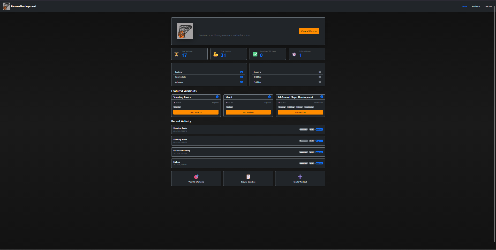

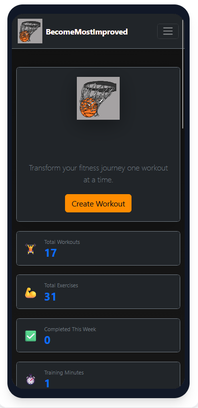

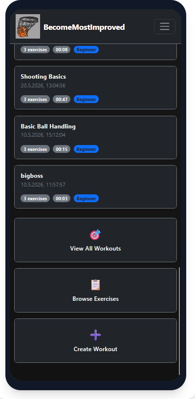

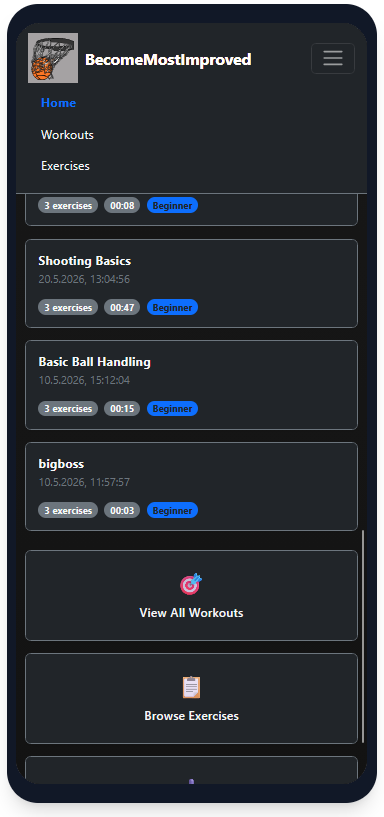

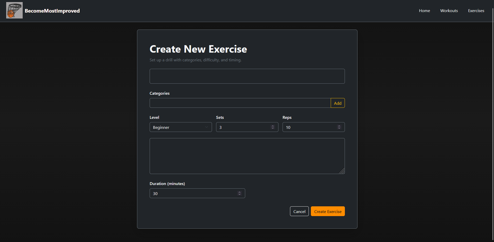

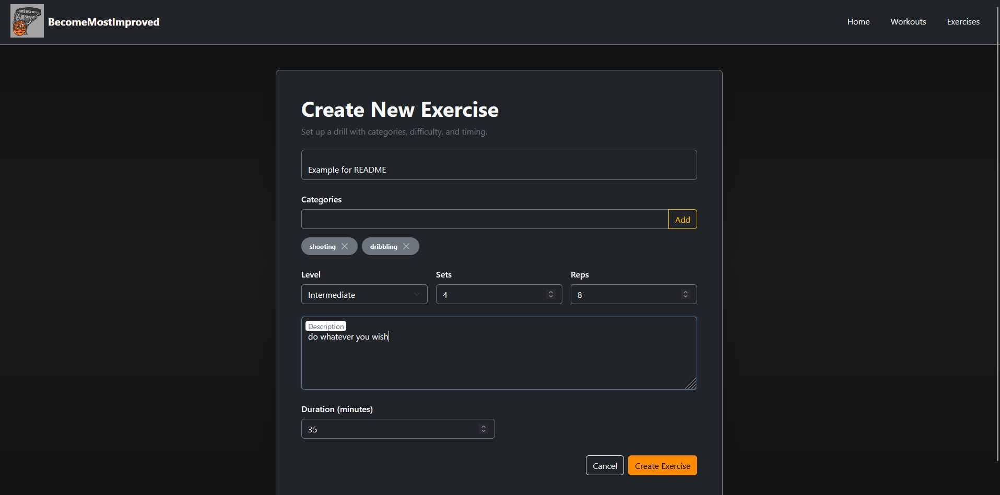

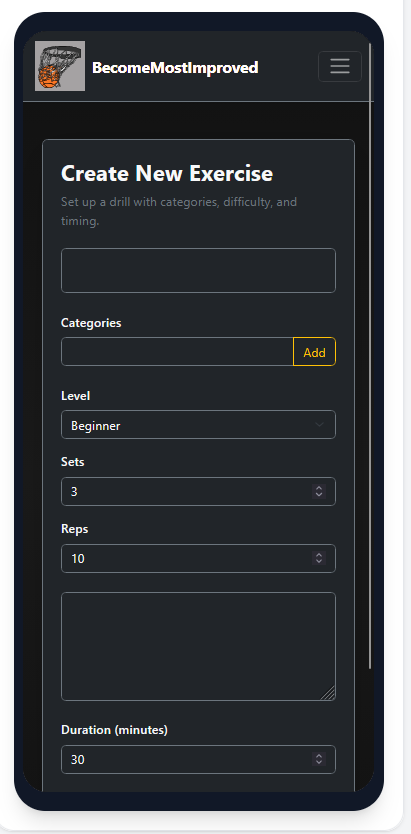

- ✅ Formular wurde schnell gefunden
- ⚠️ "Add"-Button bei Kategorie-Hinzufügung unklar
- ⚠️ Nicht klar ersichtlich, welche Felder optional sind (Description)
- ⚠️ Description-Feld nicht klar betitelt
- ⚠️ Keine Anzeige welche Felder zwingend ausgefüllt werden müssen

**Aufgabe 2 - Workout erstellen:**

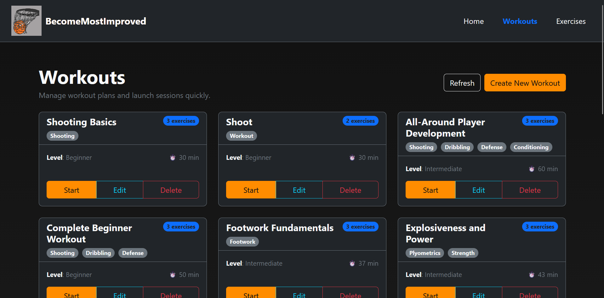

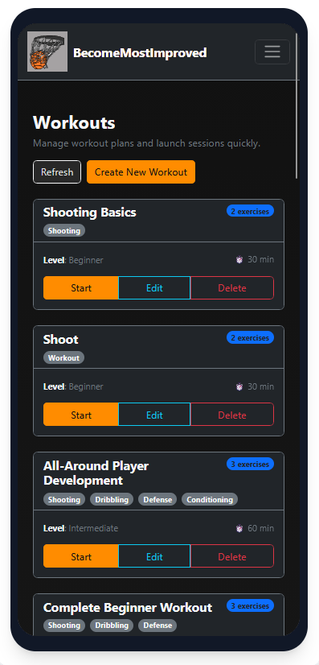

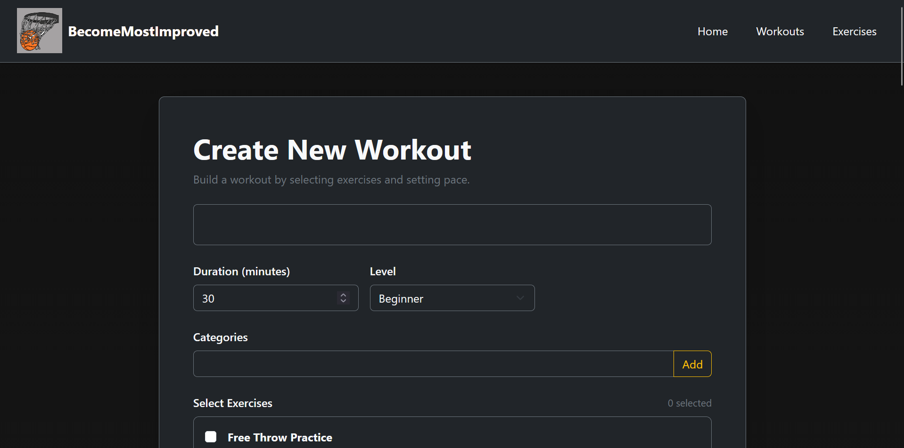

- ✅ Grundkonzept Exercise → Workout verstanden
- ⚠️ Exercise-Liste zu lang bei Workout-Erstellung, unübersichtlich
- ⚠️ Fehlermeldung erscheint oben, nicht sichtbar wenn man unten im Formular ist

**Aufgabe 3 - Session starten:**

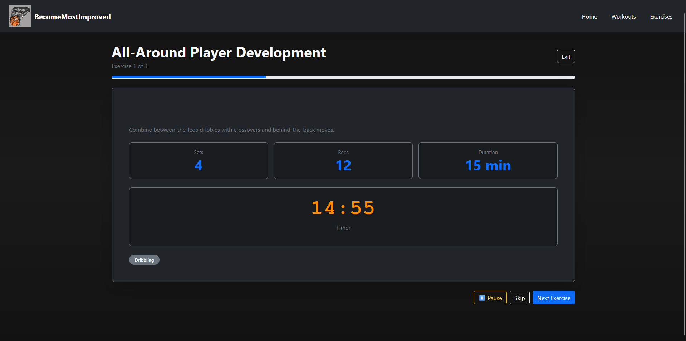

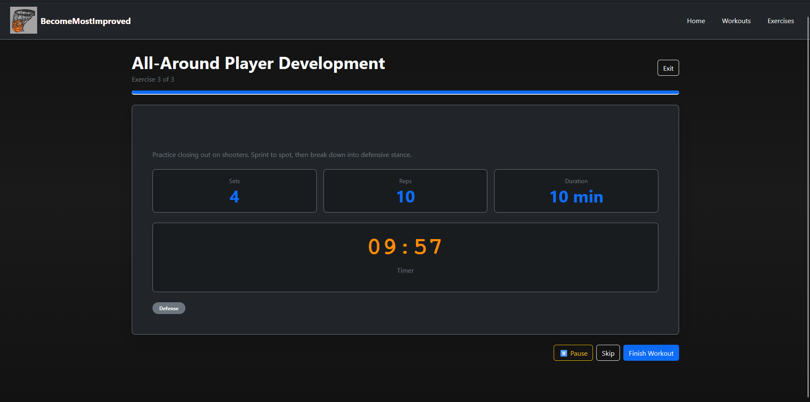

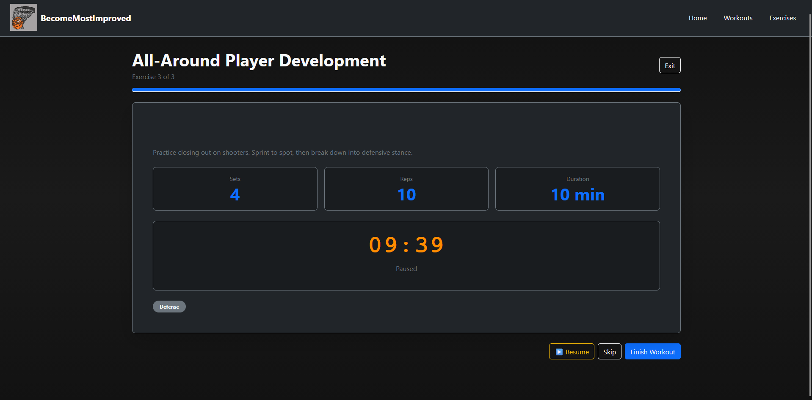

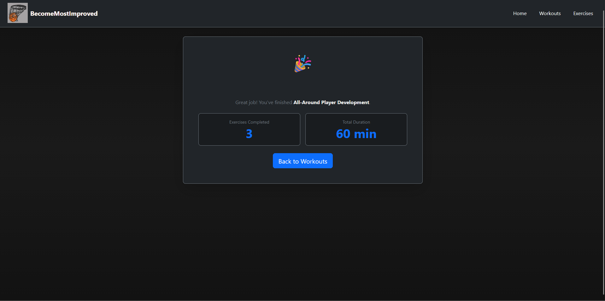

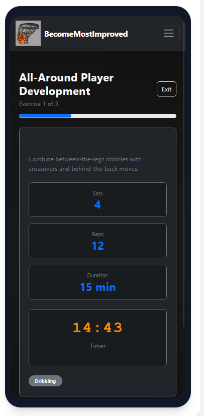

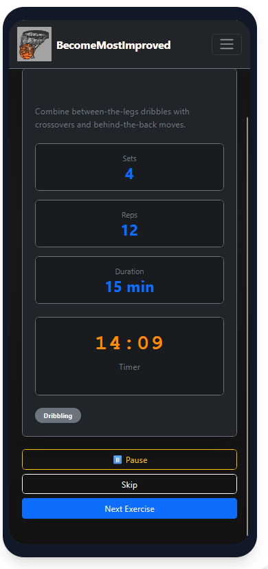

- ✅ Start-Button auf Workout-Card klar erkennbar
- ✅ Fortschrittsbalken hilft bei Orientierung
- ⚠️ Session-Screen könnte kompakter gestaltet werden
- ⚠️ Home (Dashboard) könnte kompakter gestaltet werden

**Aufgabe 4 - Bearbeiten/Löschen:**

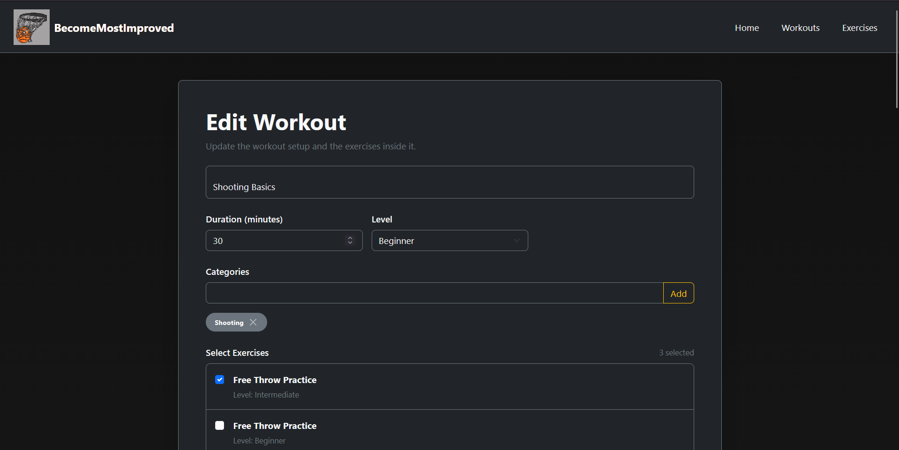

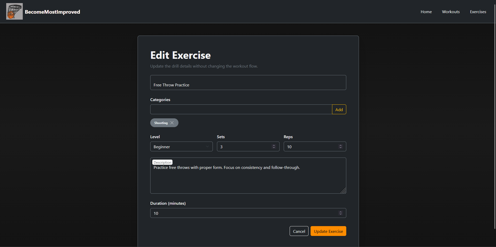

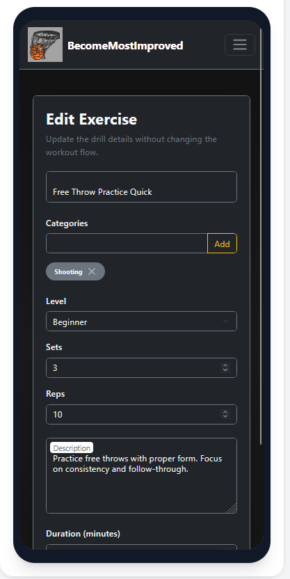

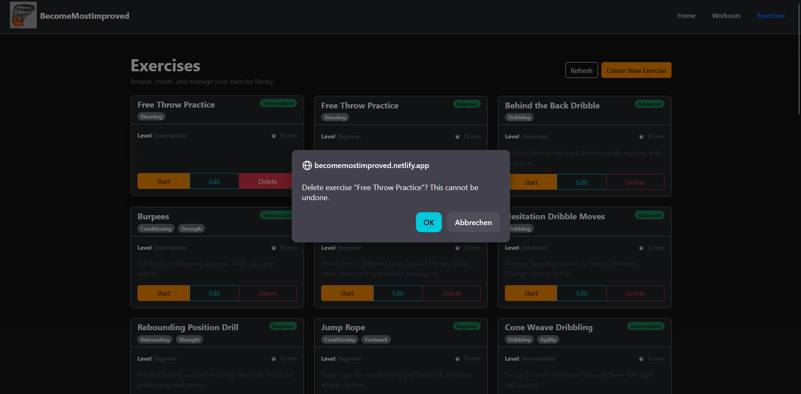

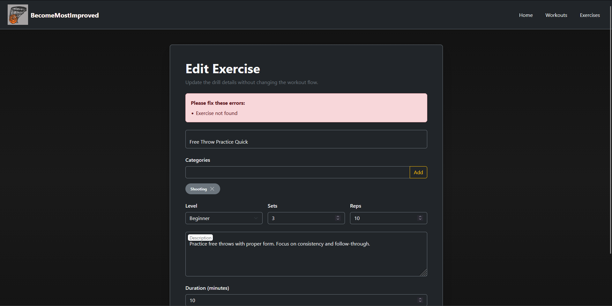

- ✅ Löschen funktioniert gut mit Bestätigungs-Modal
- ❌ "Exercise not found" Fehler beim Bearbeiten aufgetreten (kritischer Bug)
- ⚠️ Buttons Edit und Delete nicht oben, Navigation könnte klarer sein

**Evaluation Grid:**

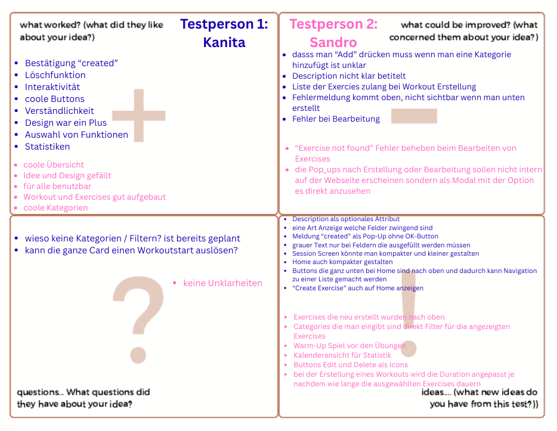

Das Evaluation Grid zeigt die vollständige Sammlung von positivem Feedback, Verbesserungsvorschlägen und neuen Ideen beider Testpersonen.

**Qualitative Findings:**

**Positive Rückmeldungen:**

- Bestätigung "created" nach Erstellung vorhanden
- Löschfunktion funktioniert gut mit Modal-Bestätigung
- Interaktivität und Buttons werden positiv bewertet ("coole Buttons")
- Design ansprechend (Dark Mode, Orange als Akzentfarbe)
- Verständlichkeit grundsätzlich gut
- Statistiken vorhanden und hilfreich
- Übersichtliches Layout mit Cards ("coole Übersicht")
- Idee und Design gefällt beiden Testpersonen
- Für alle Erfahrungsstufen benutzbar
- Workout und Exercises gut strukturiert aufgebaut

**Schwierigkeiten/Probleme:**

- "Add"-Button bei Kategorien nicht selbsterklärend
- Fehlermeldungen erscheinen oben und sind bei Scroll nicht sichtbar
- Description-Feld unklare Benennung
- Description als optionales Attribut nicht klar gekennzeichnet
- Keine klare Kennzeichnung von Pflichtfeldern vs. optionalen Feldern
- "Exercise not found" Fehler beim Bearbeiten (kritischer Bug)
- Pop-ups nach Erstellung/Bearbeitung fehlen oder sind nicht interaktiv genug
- Meldung "created" als Pop-Up ohne OK-Button
- Grauer Text bei ausgefüllten Feldern schwer lesbar
- Edit/Delete Buttons nicht optimal platziert (nicht oben)
- "Create Exercise" Button könnte auch auf Home angezeigt werden

**Verbesserungsvorschläge der Testpersonen:**

**Usability:**

- Exercises die neu erstellt wurden nach oben in der Liste anzeigen
- Eingegebene Categories automatisch als Filter für angezeigte Exercises verwenden

**Features/Nice-to-have:**

- Warm-Up Spiel vor den Übungen integrieren
- Kalenderansicht für Statistik
- Edit und Delete als Icons darstellen (platzsparender)
- Duration bei Workout-Erstellung automatisch basierend auf gewählten Exercises berechnen und anpassen

**Zusammenfassung der Resultate:**

Die Evaluation zeigt, dass die Kernfunktionalität der App funktioniert und von beiden Testpersonen grundsätzlich verstanden wird. Design, Übersichtlichkeit und Card-basierte Struktur wurden positiv bewertet. Die Terminologie Exercise/Workout/Session wurde verstanden. Hauptprobleme liegen in fehlenden oder schlecht positionierten Feedback-Mechanismen (Pop-ups, Fehlermeldungs-Positionierung), unklaren Beschriftungen (Description, "Add"-Button), fehlender Kennzeichnung von Pflichtfeldern und einem kritischen Bug beim Bearbeiten von Exercises. Beide Testpersonen empfanden die App als vielversprechend und würden sie nutzen.

**Abgeleitete Verbesserungen:**

Priorisiert nach Dringlichkeit (Kritisch → Hoch → Mittel → Niedrig):

**KRITISCH (vor Abgabe beheben):**

1. **"Exercise not found" Bug beim Bearbeiten beheben**
   - Was: Fehler beim Öffnen der Edit-Seite für Exercises
   - Begründung: Verhindert Kernfunktion (CRUD), von TP2 reproduziert
   - Aufwand: Mittel
   - Technisch: Exercise-Edit-Route und ID-Handling prüfen

**HOCH (vor Abgabe empfohlen):**

2. **"Add"-Button für Kategorien klarer beschriften**
   - Was: Button-Text ändern zu "Add Category" oder Tooltip hinzufügen
   - Begründung: Beide TPs fanden Button unklar
   - Aufwand: Gering
   - Kategorie: UX - Klarheit

3. **Description-Feld klarer benennen und als optional kennzeichnen**
   - Was: Label ändern zu "Description (optional)"
   - Begründung: Unklare Benennung und nicht ersichtlich, dass Feld optional ist
   - Aufwand: Gering
   - Kategorie: UX - Beschriftung

4. **Fehlermeldungen sichtbar positionieren**
   - Was: Fehler direkt beim betroffenen Feld anzeigen oder automatisch zu Fehler scrollen
   - Begründung: User sehen Fehler nicht bei langem Formular (scrollen nötig)
   - Aufwand: Gering
   - Kategorie: UI - Feedback-Position

5. **Pop-ups nach CRUD-Operationen hinzufügen/verbessern**
   - Was: Interaktive Toast-Notifications mit "OK"-Button: "Exercise created!", "Workout updated!", etc.
   - Begründung: Feedback fehlt oder ist nicht interaktiv, User unsicher ob Aktion erfolgreich
   - Aufwand: Gering
   - Kategorie: UX - Feedback

6. **Bearbeitungs-Fehler identifizieren und beheben**
   - Was: Genaue Fehlerquelle mit TP2 klären und beheben
   - Begründung: Unklarer Fehler verhindert Workflow
   - Aufwand: Variiert
   - Kategorie: Bug

**MITTEL (Nice-to-have vor Abgabe):**

7. **Pflichtfelder kennzeichnen**
   - Was: Rotes Sternchen \* bei Required-Feldern oder "required"-Label
   - Begründung: Nicht klar welche Felder ausgefüllt werden müssen
   - Aufwand: Gering
   - Kategorie: UX - Validierung

8. **Exercise-Liste bei Workout-Erstellung übersichtlicher gestalten**
   - Was: Scroll-Container mit fixer Höhe, Pagination oder verbesserte Filter
   - Begründung: Liste zu lang und unübersichtlich
   - Aufwand: Mittel
   - Kategorie: UX - Übersichtlichkeit

9. **Kontrast bei ausgefüllten Feldern erhöhen**
   - Was: Dunklerer Grauton für Formular-Text (bessere Lesbarkeit)
   - Begründung: Grauer Text in ausgefüllten Feldern schwer lesbar
   - Aufwand: Gering
   - Kategorie: UI - Lesbarkeit

10. **Edit/Delete Buttons besser positionieren**
    - Was: Buttons konsistenter platzieren (z.B. immer oben rechts auf Cards) oder als Icons
    - Begründung: Navigation nicht optimal, TPs mussten suchen
    - Aufwand: Gering
    - Kategorie: UI - Navigation

**NIEDRIG (falls möglich vor Abgabe / sonst Anpassung nach Abgabe für persönlichen Gebrauch):**

11. Session-Screen kompakter gestalten (UI - Layout, Aufwand: Mittel)
12. Home/Dashboard kompakter gestalten (UI - Layout, Aufwand: Mittel)
13. "Create Exercise" Button auch auf Home anzeigen (UX - Workflow, Aufwand: Gering)
14. Neu erstellte Exercises oben in Liste anzeigen (UX, Aufwand: Gering)
15. Eingegebene Categories als direkte Filter verwenden (UX, Aufwand: Mittel)
16. Warm-Up Spiel vor Übungen integrieren (Feature, Aufwand: Hoch)
17. Kalenderansicht für Statistik (Feature, Aufwand: Hoch)
18. Edit/Delete als Icons statt Text-Buttons (UI, Aufwand: Gering)
19. Duration bei Workout-Erstellung automatisch berechnen (Feature, Aufwand: Mittel)

_Hinweis: Aufgrund der Nähe zur Abgabefrist können eventuell nicht alle identifizierten Verbesserungen umgesetzt werden. Priorisiert wurden kritische Bugs und Issues mit hoher Priorität und geringem Aufwand._

**Umgesetzte Verbesserungen:**

Nach der Evaluation vom 21. Mai 2026 wurden folgende Verbesserungen implementiert:

**KRITISCH (behoben):**
1. ✅ **"Exercise not found" Bug behoben** - Edit-Funktionalität prüft nun korrekt ObjectId und gibt aussagekräftige Fehler zurück

**HOCH (umgesetzt):**
2. ✅ **"Add Category" Button-Text** - Geändert in allen Forms (`/exercises/new`, `/workouts/new`, Edit-Pages)
3. ✅ **"Description (optional)" Label** - Implementiert in Exercise-Forms, Feld ist nun optional
4. ✅ **Pflichtfelder mit rotem Sternchen** - Alle required-Felder markiert mit `<span style="color: red;">*</span>`
5. ✅ **Feldspezifische Fehlermeldungen** - Validierungsfehler erscheinen direkt beim betroffenen Feld
6. ✅ **Toast-Notifications** - Implementiert für alle CRUD-Operationen (Success/Error)

**MITTEL (umgesetzt):**
7. ✅ **Auto-Sortierung** - Exercises/Workouts nach Datum, Level, Name sortierbar
8. ✅ **Exercise-Liste übersichtlicher** - Workout-Erstellung mit Auto-Filter nach Kategorie
9. ✅ **Kontrast erhöht** - Textfelder mit `#e9ecef`, Nicht-Textfelder mit `#adb5bd`
10. ✅ **Auto-Filter bei Workout-Erstellung** - Filtert Exercises automatisch nach gewählter Workout-Kategorie

**ZUSÄTZLICH IMPLEMENTIERT (über Evaluation hinaus):**
- ✅ **Favoriten-System** - Workouts markierbar, Dashboard zeigt "Favorite Workouts"
- ✅ **Auto-Duration** - Automatische Berechnung + Backfill-Script
- ✅ **Performance-Tweaks** - Preconnect, Preload, Cache-Headers
- ✅ **Session-History** - Recent Activity im Dashboard mit Lösch-Funktion
- ✅ **Optimistic UI** - Sofortiges Feedback bei Favoriten-Toggle

**Implementierte Dateien (Auswahl):**
- `src/lib/stores/toast.js` - Toast-System
- `src/lib/components/WorkoutCard.svelte` - Favorite-Toggle
- `src/routes/api/workouts/toggleFavorite/+server.js` - API-Endpoint
- `scripts/backfill_durations.js` - Duration-Backfill
- `src/styles/overrides.css` - Kontrast-Verbesserungen

> **Hinweis zu Screenshots:** Die Screenshots in diesem Kapitel ("tested-*") dokumentieren den Stand der Anwendung **zum Testzeitpunkt (21. Mai 2026)** und zeigen teilweise noch nicht behobene Issues. Aktuelle Screenshots der finalen Version befinden sich am Ende dieses Kapitels unter "Finale Version nach Verbesserungen".

**Screenshots der finalen Version (nach Evaluation):**

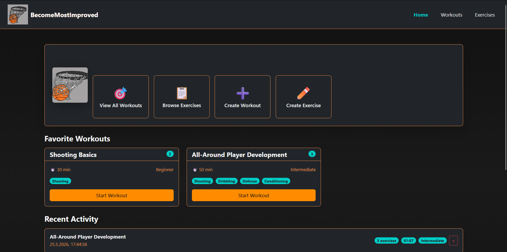
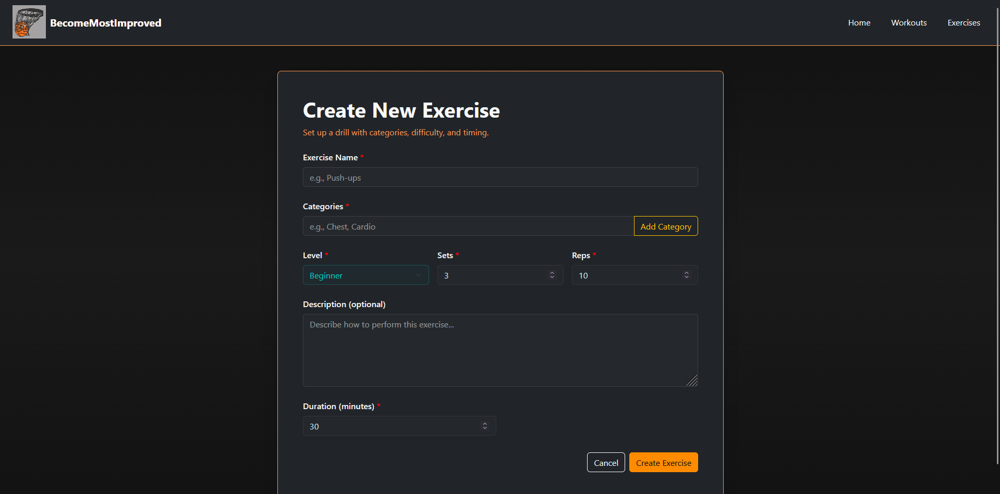
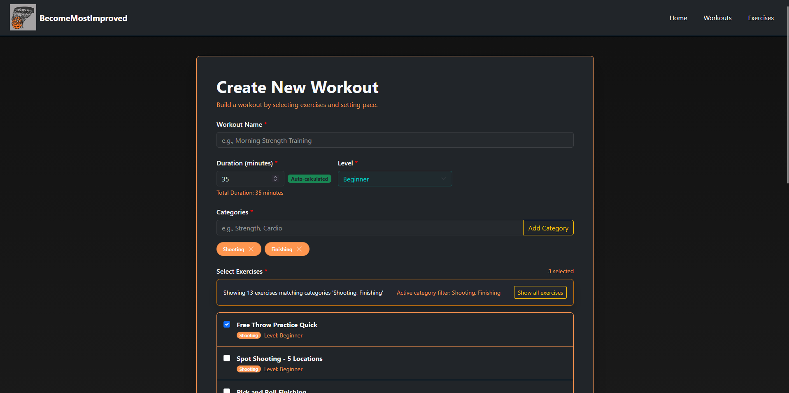
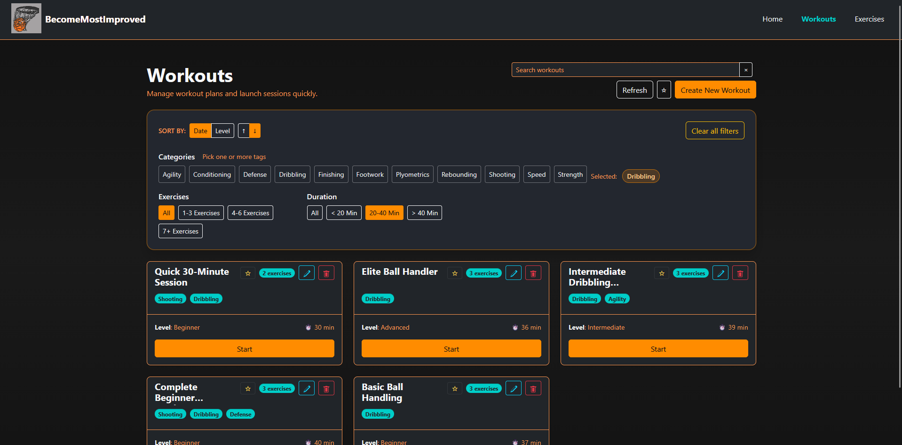
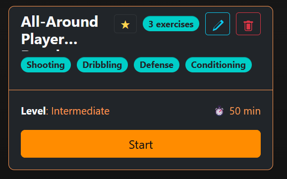
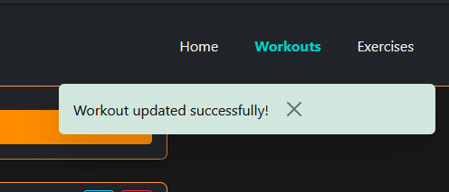
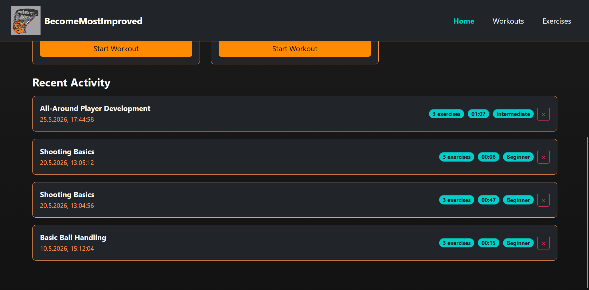

## 4. Erweiterungen [Optional]

Dieses Kapitel dokumentiert Features, die über den Mindestumfang der Aufgabenstellung hinausgehen.

> **Mindestumfang laut Übungen:**
> - CRUD für Exercises und Workouts
> - Mindestens 1 Übersichtsseite, 1 Erfassungsseite
> - MongoDB-Persistenz
> - SvelteKit + Komponenten
> - Git/GitHub, Deployment

---

### 4.1 Favoriten-System

**Beschreibung & Nutzen:**

Nutzer können Workouts als Favoriten markieren. Favorisierte Workouts werden prominent im Dashboard angezeigt ("Favorite Workouts") und können gefiltert werden. Unterstützt optimistische UI für sofortiges visuelles Feedback.

**Wo umgesetzt:**

- **Frontend:**
  - `src/lib/components/WorkoutCard.svelte` - Favorite-Star-Toggle
  - `src/routes/+page.svelte` - Dashboard "Favorite Workouts" Section
  - `src/routes/workouts/+page.svelte` - "Show only favorites" Filter

- **Backend:**
  - `src/routes/api/workouts/toggleFavorite/+server.js` - Toggle-Endpoint
  - `src/routes/+page.server.js` - Dashboard-Query mit Favorite-Sorting

- **Datenbank:**
  - `workouts` Collection: `isFavorite` (boolean), `favoritedAt` (date)

**Referenz:** Screenshots `final-dashboard.png`, `final-workouts-filter.png`

**Aus Evaluation abgeleitet?:** Ja - Usability-Verbesserung für schnellen Zugriff

---

### 4.2 Filter-Funktionen

**Beschreibung & Nutzen:**

Umfassende Filter-Optionen für Exercises und Workouts:
- Nach Kategorie (Dropdown mit allen vorhandenen Categories)
- Nach Level (Beginner, Intermediate, Advanced)
- Nach Duration (< 10 Min, 10-20 Min, > 20 Min)
- Text-Suche (q-Parameter)
- "Show only favorites" für Workouts

Erleichtert Navigation bei grossen Datenbeständen.

**Wo umgesetzt:**

- **Frontend:**
  - `src/routes/exercises/+page.svelte` - Filter-UI
  - `src/routes/workouts/+page.svelte` - Filter-UI mit Favorite-Toggle

- **Backend:**
  - `src/routes/api/exercises/+server.js` - Server-side Filtering
  - `src/routes/api/workouts/+server.js` - Server-side Filtering mit MongoDB Aggregation

- **URL-Parameter:** `?category=Shooting&level=Beginner&duration=10-20&favorite=1`

**Referenz:** Screenshot `final-workouts-filter.png`

**Aus Evaluation abgeleitet?:** Ja - Issue 8 (Exercise-Liste übersichtlicher gestalten)

---

### 4.3 Auto-Duration-Berechnung

**Beschreibung & Nutzen:**

Beim Erstellen/Bearbeiten eines Workouts wird die Gesamtdauer automatisch aus den gewählten Exercises berechnet. Berücksichtigt optionale Pausen zwischen Exercises (`pausePerExercise`). Verhindert manuelle Fehler und spart Zeit.

**Wo umgesetzt:**

- **Frontend:**
  - `src/routes/workouts/new/+page.svelte` - Reactive `$: autoDuration` Berechnung
  - `src/routes/workouts/[id]/edit/+page.svelte` - Auto-Duration mit Update-Badge
  - Zeigt Warnung wenn Exercises ohne Duration ausgewählt werden

- **Backend:**
  - `scripts/backfill_durations.js` - Backfill-Script für bestehende Workouts

- **Datenbank:**
  - `workouts.duration` wird automatisch berechnet/aktualisiert

**Referenz:** Screenshot `final-workout-builder.png`

**Aus Evaluation abgeleitet?:** Ja - Usability-Verbesserung + Datenkonsistenz

---

### 4.4 Sortierung (Multi-Mode)

**Beschreibung & Nutzen:**

Flexible Sortier-Optionen für Exercises und Workouts:
- Nach Erstellungsdatum (neueste/älteste zuerst)
- Nach Level (Beginner → Advanced oder umgekehrt)
- Nach Name (alphabetisch)
- Nach Update-Datum

Server- und clientseitig implementiert.

**Wo umgesetzt:**

- **Frontend:**
  - `src/routes/exercises/+page.svelte` - Sort-Links
  - `src/routes/workouts/+page.svelte` - Sort-Links

- **Backend:**
  - `src/routes/exercises/+page.server.js` - `getSortMode()` / `getSortDirection()`
  - `src/routes/workouts/+page.server.js` - Favorite-Sorting by `favoritedAt`

**URL-Parameter:** `?sort=level&dir=asc`

**Referenz:** Kapitel 3.4.2 - Struktur

**Aus Evaluation abgeleitet?:** Teilweise - Best Practice + Evaluation Issue 7

---

### 4.5 Toast-Notifications

**Beschreibung & Nutzen:**

Globales Toast-System für Success/Error-Feedback bei allen CRUD-Operationen und Favoriten-Aktionen. Verbessert User Experience durch klares, nicht-invasives Feedback.

**Wo umgesetzt:**

- **Frontend:**
  - `src/lib/stores/toast.js` - Svelte Store für Toast-State
  - `src/lib/components/ToastNotification.svelte` - Toast-Komponente (angenommen)
  - Aufrufe in: ExerciseCard, WorkoutCard, Forms, Delete-Actions

- **Backend:**
  - Server-Actions geben Success/Error-Status zurück

**Referenz:** Screenshot `final-toast-notification.png`

**Aus Evaluation abgeleitet?:** Ja - Issue 5 (Pop-ups nach CRUD-Operationen)

---

### 4.6 Session-History & Recent Activity

**Beschreibung & Nutzen:**

Protokollierung aller durchgeführten Trainings-Sessions mit Start-/End-Zeitstempel und tatsächlicher Dauer. Dashboard zeigt "Recent Activity" mit letzten 5 Sessions. User können einzelne Sessions aus History entfernen.

**Wo umgesetzt:**

- **Frontend:**
  - `src/routes/+page.svelte` - Dashboard "Recent Activity" Section
  - `src/routes/workouts/[id]/session/+page.svelte` - Session-Tracking
  - `src/routes/exercises/[id]/session/+page.svelte` - Session-Tracking

- **Backend:**
  - `src/routes/api/sessions/+server.js` - Session CRUD
  - `src/routes/+page.server.js` - Recent Activity Query + Delete-Action

- **Datenbank:**
  - `sessions` Collection: workoutId/exerciseId, startedAt, completedAt, `actualDurationSeconds`

**Referenz:** Screenshot `final-dashboard.png`

**Aus Evaluation abgeleitet?:** Ja - History-Feature war geplant, Lösch-Funktion aus Feedback

---

### 4.7 Pausentimer

**Beschreibung & Nutzen:**

Konfigurierbare Pausen zwischen Exercises mit automatischem Countdown-Timer. Workout kann `pausePerExercise` (in Sekunden) definieren. Session-Page zeigt Break-Timer mit visueller Anzeige.

**Wo umgesetzt:**

- **Frontend:**
  - `src/routes/workouts/[id]/session/+page.svelte` - Break-Timer-Logik
  - `src/routes/workouts/new/+page.svelte` - Pause-Per-Exercise Input
  - `src/routes/workouts/[id]/edit/+page.svelte` - Pause-Per-Exercise Edit

- **Backend:**
  - Keine separate Persistenz nötig (Teil von Workout-Daten)

**Referenz:** Kapitel 3.4.1 - Session-Durchführung

**Aus Evaluation abgeleitet?:** Ja - Session-UX-Verbesserung

---

### 4.8 Optimistische UI-Updates

**Beschreibung & Nutzen:**

Sofortige UI-Änderung vor Server-Bestätigung (z.B. Favoriten-Toggle). Bei Fehler: Automatisches Rollback. Erhöht wahrgenommene Performance und Responsiveness.

**Wo umgesetzt:**

- **Frontend:**
  - `src/lib/components/WorkoutCard.svelte` - Lokaler State `isFavoriteLocal`
  - Fetch POST zu toggleFavorite-Endpoint
  - Error-Handling mit Rollback + Toast

**Referenz:** Kapitel 3.4.1 - UX-Verbesserungen

**Aus Evaluation abgeleitet?:** Ja - Best Practice für moderne Web-Apps

---

### 4.9 Auto-Duration Backfill-Script

**Beschreibung & Nutzen:**

Node.js-Script zum Nachberechnen und Aktualisieren fehlender/inkonsistenter `workout.duration`-Werte in der Datenbank. Sichert Datenkonsistenz nach Einführung der Auto-Duration-Funktion.

**Wo umgesetzt:**

- **Script:**
  - `scripts/backfill_durations.js` - Nutzt MONGODB_URI, aktualisiert workouts Collection

**Verwendung:**
```bash
node scripts/backfill_durations.js
```

**Referenz:** Kapitel 3.4.2 - Tools & Scripts

**Aus Evaluation abgeleitet?:** Ja - Datenmigration nach Feature-Einführung

---

### 4.10 Performance-Optimierungen

**Beschreibung & Nutzen:**

Diverse Performance-Tweaks für schnellere Ladezeiten:
- Preconnect/Preload für Fonts und externe Resources (`src/app.html`)
- Netlify Cache-Control Headers für statische Assets (`netlify.toml`)
- Optimierte MongoDB-Queries (Indexing auf häufig gefilterte Felder)

**Wo umgesetzt:**

- **Frontend:**
  - `src/app.html` - `<link rel="preconnect">`, `<link rel="preload">`

- **Deployment:**
  - `netlify.toml` - Custom Cache-Control Headers

**Referenz:** Kapitel 3.4.2 - Deployment & Performance

**Aus Evaluation abgeleitet?:** Ja - Deployment/Performance-Optimierungen

---

### 4.11 Responsive/Mobile-Optimierungen

**Beschreibung & Nutzen:**

UI nutzt Bootstrap-Responsive-Klassen und Custom-CSS-Overrides für optimale Darstellung auf kleinen Bildschirmen. Mobile Navigation mit Hamburger-Menu.

**Wo umgesetzt:**

- **Frontend:**
  - `src/styles/overrides.css` - Mobile-specific Styles
  - `src/routes/+layout.svelte` - Responsive Navigation
  - Bootstrap-Klassen: `d-none d-md-block`, `col-12 col-md-6` etc.

**Referenz:** Screenshots `tested-mobile-*`

**Aus Evaluation abgeleitet?:** Teilweise - Best Practice + Testing

---

### 4.12 Nicht implementierte Features (Geplant für V2)

**Drag-and-Drop Workout-Builder:**
- Beschreibung: Reihenfolge der Exercises per Drag&Drop ändern
- Status: Nicht implementiert (Selection-basiertes Interface stattdessen)
- Grund: Aufwand vs. Nutzen; aktuelle Lösung funktional ausreichend

**Workout-Rating-System:**
- Beschreibung: User-Bewertungen (1-5 Sterne) für Workouts
- Status: Nicht implementiert (History vorhanden, Ratings fehlen)
- Grund: Zeitliche Priorisierung; V2-Feature

## 5. Projektorganisation [Optional]

Beispiele:

- **Repository & Struktur:** 

https://github.com/MonkeyDsvakidan/BecomeMostImproved

```
/BecomeMostImproved
├── src/
│ ├── routes/ # SvelteKit Pages & API-Routes
│ ├── lib/
│ │ ├── components/ # Wiederverwendbare UI-Komponenten
│ │ └── stores/ # Svelte Stores (toast.js)
│ ├── styles/ # Global CSS (overrides.css)
│ └── app.html # HTML-Template (preconnect/preload)
├── scripts/ # Helper-Scripts (backfill_durations.js)
├── static/ # Statische Assets
├── netlify.toml # Netlify-Konfiguration
└── package.json # Dependencies
```


**Build & Deployment:**

```bash
# Installation
npm install

# Development
npm run dev

# Build
npm run build

# Deployment
# Manuell via Netlify
```

**Commit-Praxis:**

- Conventional Commits: `feat:`, `fix:`, `refactor:`, `docs:`
- Beispiele:
  - `feat: add favorites system with toggle and dashboard integration`
  - `fix: resolve exercise edit bug with ObjectId validation`
  - `refactor: improve form field contrast for better readability`

**Issue-Management:**

GitHub Issues für Bug-Tracking und Feature-Requests. Evaluation-Findings wurden als Issues dokumentiert und systematisch abgearbeitet.

## 6. KI-Deklaration

Die folgende Deklaration ist verpflichtend und beschreibt den Einsatz von KI im Projekt.

### 6.1 KI-Tools

**Eingesetzte Tools**:

- Perplexity AI (Claude-Modell)
- GitHub Copilot (in VS Code)

**Zweck & Umfang**:

- **Perplexity/Claude**: Ideenentwicklung, Strukturplanung, Prompt-Erstellung für Code-Generierung
- **GitHub Copilot**: Code-Vorschläge, Auto-Completion, Refactoring, Komponentenerstellung
- **Umfang**: Ca. 70% des Codes mit KI-Unterstützung generiert, alle Prompts und generierten Inhalte wurden manuell überprüft und angepasst

**Eigene Leistung (Abgrenzung):**

- Konzeption der App-Struktur, Workflows und Features
- Erstellung aller Skizzen, Mockups und Designentscheidungen
- Evaluation und Usability-Tests
- Code-Review, Debugging und Anpassungen aller KI-generierten Code-Snippets
- Integration und Deployment
- Gesamte Projektdokumentation

### 6.2 Prompt-Vorgehen

**Grundlegende Vorgehensweise:**

1. **Ideenentwicklung**:

   Projektidee und Features mit Perplexity/Claude besprochen, technische Machbarkeit geprüft

2. **Strukturaufbau**:

   Erste Prompts fokussierten auf Grundgerüst (SvelteKit-Setup, Routing, Basisstruktur)

3. **Inkrementelle Entwicklung**:

   Features wurden schrittweise eingeführt
   - Zuerst Exercise-CRUD (Create, Read, Update, Delete)

   - Dann Workout-Erstellung mit Exercise-Auswahl

   - Anschliessend Session-Durchführung

   - Zuletzt Filter und History (Rating war geplant, wurde aber bewusst für eine spätere Version zurückgestellt)

4. **Git-Commits parallel zu Prompts**:

   Jeder Entwicklungsschritt wurde committed, sodass Prompts und Code-Änderungen nachvollziehbar sind

5. **Iteratives Refinement**:

   KI-generierter Code wurde getestet, Fehler identifiziert, durch Folgeprompts korrigiert

**Beispiel-Prompt-Struktur:**

"Erstelle eine SvelteKit-Komponente 'ExerciseCard', die folgende Props erhält: name, category, level, sets, reps. Die Card soll einen Start-Button und einen Edit-Button enthalten. Verwende Tailwind CSS für Styling mit Dark Mode."

### 6.3 Reflexion

**Nutzen:**

- Deutliche Beschleunigung der Entwicklung, besonders bei repetitiven Aufgaben (CRUD-Operationen, Formular-Validierung)
- Unterstützung bei unbekannten SvelteKit-Konzepten (z.B. Form Actions, Stores)
- Schnelles Prototyping von UI-Komponenten

**Grenzen:**

- KI versteht Kontext nicht immer vollständig, generiert teilweise inkonsistenten Code
- Komplexe Logik (z.B. Session-State-Management) erfordert manuelle Nacharbeit
- Styling-Vorschläge entsprechen nicht immer dem gewünschten Design

**Qualitätssicherung:**

- Jeder generierte Code-Block wurde manuell getestet
- Code-Review vor jedem Git-Commit
- Funktionale Tests aller Features im Browser
- Usability-Evaluation mit echten Nutzern

**Urheberrecht:**

- Alle von KI generierten Code-Snippets wurden angepasst und in eigenes Projekt integriert
- Keine direkten Kopien von Drittanbieter-Code ohne Lizenzprüfung
- Eigene Verantwortung für finalen Code übernommen

## 7. Anhang [Optional]

**Wichtige Dateien:**

- [scripts/backfill_durations.js](scripts/backfill_durations.js) - Auto-Duration Backfill-Script
- [netlify.toml](netlify.toml) - Deployment-Konfiguration mit Cache-Headers
- [src/lib/stores/toast.js](src/lib/stores/toast.js) - Toast-Notification Store
- [src/routes/api/workouts/toggleFavorite/+server.js](src/routes/api/workouts/toggleFavorite/+server.js) - Favorite-Toggle API

**Quellen & Referenzen:**

- Bootstrap 5 Documentation: https://getbootstrap.com/docs/5.3/
- SvelteKit Documentation: https://kit.svelte.dev/docs
- MongoDB Node.js Driver: https://www.mongodb.com/docs/drivers/node/
- Netlify Deployment: https://docs.netlify.com/

**Evaluations-Material:**

- Evaluation Grid: `readme-images/evaluation-grid.jpg`
- Test-Screenshots (21. Mai 2026): `readme-images/tested-*`
- Finale Screenshots: `readme-images/final-*`